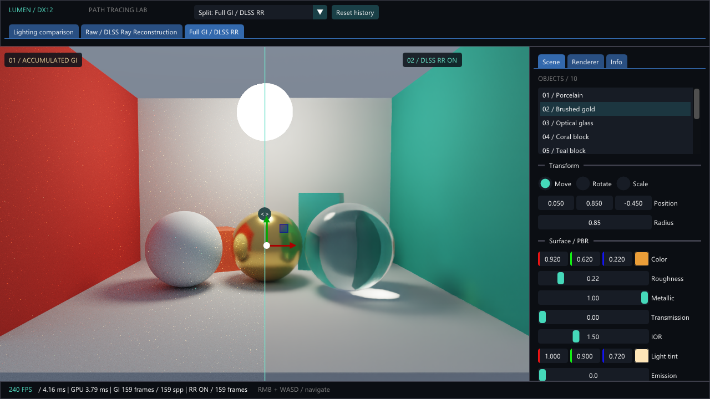
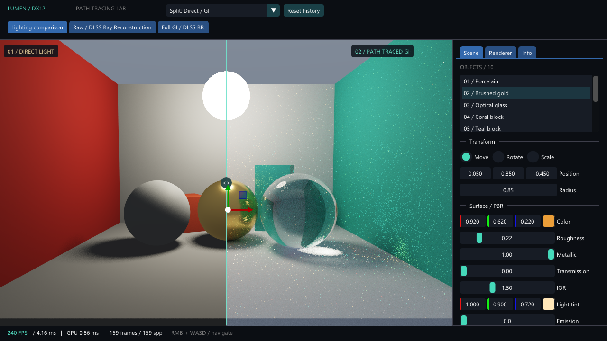
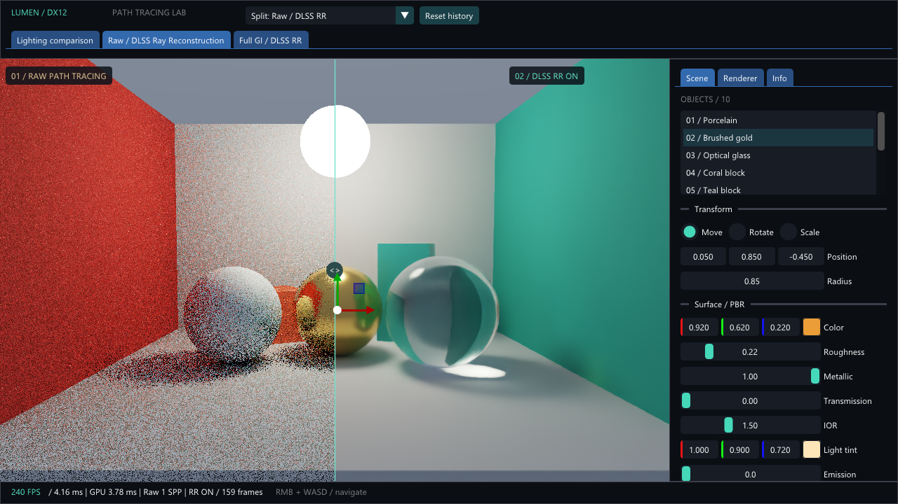

# DX12 Path Tracing Simulator 기술 해설서

이 문서는 **현재 저장소의 실제 구현**을 설명한다. 숫자는 기본 장면과 기본 설정을 기준으로 하며, 에디터에서 바꾸면 즉시 달라진다. NVIDIA DLSS Ray Reconstruction(RR)의 신경망 내부 수식은 공개되지 않아 설명할 수 없는 부분을 추정하지 않는다.

## 1. 가장 먼저 알아둘 결론

**Full global illumination(Full GI)은 프레임 누적 방식이다.** 한 프레임에서 픽셀당 `SPP`개의 경로를 계산하고, 이전 프레임까지의 평균과 새 결과를 섞어 RGBA32F 텍스처 두 장에 번갈아 기록한다. 장면·카메라·조명·렌더 설정이 바뀌면 이 평균을 버리고 다시 시작한다. 이는 포트폴리오에 서술된 OpenGL 작품의 *프레임 난수 + 1/N 평균 누적 + 카메라 변경 시 리셋*이라는 핵심 원리와 같다. 다만 원본 OpenGL 셰이더가 저장소에 없어 광선 교차·재질·광원 처리까지 일대일로 같은 구현이라고 말할 수 없다. 현재 DX12 Full GI는 여러 표면을 지나며 간접광까지 계산하는 별도 렌더러다.

**DLSS는 NVIDIA의 여러 AI 렌더링 기능을 아우르는 이름이다.** Super Resolution(SR)은 낮은 해상도의 영상을 높은 해상도로 재구성하는 기능이고, Ray Reconstruction(RR)은 레이 트레이싱의 노이즈를 재구성하는 기능이다. 이 프로젝트는 **실제 NVIDIA NGX DLSS RR**을 실행한다. RR을 입력·출력 해상도가 같은 `DLAA` 품질 모드로 생성하므로 별도의 DLSS SR 업스케일링, Frame Generation, Ray Retargeting은 구현하지 않았다. RR을 사용하더라도 광선을 추적하는 것은 이 프로젝트의 DX12 compute shader다. RR은 계산된 noisy HDR 결과를 후처리한다. [NVIDIA DLSS SDK](https://github.com/NVIDIA/DLSS), [NVIDIA DLSS RR 통합 가이드](https://github.com/NVIDIA/DLSS/blob/main/doc/DLSS-RR%20Integration%20Guide.pdf)

**DXGI**는 DirectX Graphics Infrastructure의 약자로, GPU 어댑터 선택과 화면에 영상을 내보내는 스왑체인 등을 담당한다. 여기서는 `IDXGIFactory`/`IDXGIAdapter`/`IDXGISwapChain3`을 사용한다. RR이나 노이즈 제거 기술이 아니다.



위 캡처는 1280×720 창, 내부 렌더 스케일 1.0, 1 SPP, 160프레임 렌더 후의 **Full GI / DLSS RR** 탭이다. 왼쪽은 표시된 누적 이력 159프레임의 산술 평균, 오른쪽은 같은 프레임의 noisy 경로 추적 결과를 RR로 재구성한 것이다. 로그의 총 RR 평가 횟수는 160회이며, 중간 이력 리셋 때문에 표시된 연속 이력은 159다. 양쪽의 장면·카메라·노출·내부 해상도·한 프레임 SPP는 같지만 **사용한 시간 이력과 알고리즘이 다르므로 동일 작업량 또는 객관적 화질 우위의 정량 벤치마크는 아니다.**

## 2. 화면의 여섯 단독/분할 모드와 세 탭

| 모드 번호 | 메뉴 이름 | 화면에 보이는 것 | 누적 평균 표시 | NVIDIA RR 실행 |
|---:|---|---|---|---|
| 0 | Full global illumination | 다중 바운스 GI | 예 | 아니오 |
| 1 | Direct light baseline | 단일 표면 직접광 기준 | 예 | 아니오 |
| 2 | Split: Direct / GI | 왼쪽 직접광, 오른쪽 GI | 예 | 아니오 |
| 3 | Split: Raw / DLSS RR | 왼쪽 현재 프레임 raw, 오른쪽 RR | 아니오 | 예 |
| 4 | DLSS RR only | RR 결과만 | 아니오 | 예 |
| 5 | Raw path tracing only | 현재 프레임 raw만 | 아니오 | 아니오 |
| 6 | Split: Full GI / DLSS RR | 왼쪽 누적 GI, 오른쪽 RR | 왼쪽만 | 예 |

상단 탭 **Lighting comparison**은 모드 2, **Raw / DLSS Ray Reconstruction**은 모드 3, 새 **Full GI / DLSS RR**은 모드 6으로 이동한다. 모드 6에서는 누적이 자동으로 켜지고 설정을 끌 수 없다. 분할선은 두 결과 중 화면에 보여줄 영역만 바꾸므로 모드 3·6에서는 이력을 초기화하지 않는다. 모드 2는 분할선 위치에 따라 픽셀별로 직접광 또는 GI를 *다르게 렌더링*하므로 이동 시 누적을 리셋한다.

RR을 지원하지 않는 GPU/드라이버/런타임에서는 RR 쪽에 원본 raw가 표시되고 `RR NOT ACTIVE`와 진단 메시지가 나온다. 이 상태를 RR 적용 성공이라고 해석하면 안 된다. `RR history`는 RR의 앱 측 연속 평가 프레임 수이고, 신경망이 몇 프레임을 실제로 사용했는지나 모델 내부의 가중치를 뜻하지 않는다.





## 3. 세 가지 노이즈 처리 경로의 차이

공통 시작점은 이 앱의 DX12 HLSL path tracer다. 그 결과를 `NoisyColor`라는 HDR float 텍스처에 기록한다.

```text
장면 + 카메라 → DX12 compute path tracer → 현재 프레임 HDR Cₙ
                                      ├─ raw: Cₙ 그대로 표시
                                      ├─ Full GI: 이전 평균 Aₙ₋₁과 1/N 누적 → Aₙ 표시
                                      └─ DLSS RR: Cₙ + 깊이/법선/재질/모션 등 가이드
                                                    + RR 내부 시간 이력 → RR 출력 표시
공통 화면 처리: 노출 → ACES 근사 → 감마 2.2 → DXGI 스왑체인
```

| 질문 | 기존 OpenGL 포트폴리오 | 이 앱 Full GI | 이 앱 DLSS RR | DLSS Super Resolution |
|---|---|---|---|---|
| 실제 계산 API | OpenGL/GLSL(포트폴리오 설명) | DirectX 12/HLSL compute | 경로 생성은 DX12, 재구성은 NVIDIA NGX | 이 앱에서 미구현 |
| 주요 목적 | 레이 트레이싱 시뮬레이터 | 다중 반사·굴절·간접광 및 평균 수렴 | noisy 레이 트레이싱 출력 재구성 | 보통 저해상도 입력의 고해상도 재구성 |
| 시간적 처리 | 프레임 난수와 1/N 누적(포트폴리오 설명) | 명시적 산술 평균 | NVIDIA 모델의 시간적 재구성; 내부 수식 비공개 | 이 앱에서 미구현 |
| 해상도 | 원본 실행/소스 없어서 수치 불명 | 내부 해상도 | 입력=출력 내부 해상도(DLAA) | 해당 없음 |
| 신경망 사용 | 증거 없음 | 없음 | 있음 | 이 앱에서 미구현 |

따라서 **OpenGL의 누적 방식과 Full GI의 누적 원리는 같지만**, 직접광 기준 모드는 OpenGL 바이너리를 실행하거나 원본 셰이더를 복제한 것이 아니다. 비교용으로 만든 단일 표면 조명 모델이다. `DLSS RR`은 이 누적 평균의 별칭이 아니며, `DLSS SR`과도 목적과 입력이 다르다. NVIDIA는 RR을 DLSS 기능 확장으로 설명하며 기존 수작업 denoiser를 대체하는 용도로 안내한다. [NVIDIA Streamline RR 프로그래밍 가이드](https://github.com/NVIDIA-RTX/Streamline/blob/main/docs/ProgrammingGuideDLSS_RR.md)

## 4. 한 프레임의 처리 순서

1. `Application`이 Win32 메시지·창 크기를 처리하고 UI 입력을 받는다.
2. `Scene`이 카메라·최대 64개 오브젝트와 재질을 프레임별 GPU 업로드 버퍼에 쓴다. 기본 장면은 10개 오브젝트다.
3. `PathTracer`가 내부 렌더 해상도를 맞추고 8×8 compute thread group을 실행한다. 현재 noisy HDR, 누적 HDR, RR 가이드 7종을 작성한다.
4. RR 모드 3·4·6이면 `RayReconstruction`이 현재 noisy HDR과 가이드를 NVIDIA NGX에 전달하고 결과를 받는다.
5. `PostProcessor`가 선택된 화면을 한 장의 풀스크린 삼각형으로 백버퍼에 그리며 노출·톤매핑·감마를 적용한다.
6. `EditorUI`가 창/숫자/기즈모/분할선을 겹쳐 그린다. `D3D12Context`가 스왑체인을 표시하고 fence로 리소스 재사용을 동기화한다.

이 앱은 **DXR 하드웨어 가속 구조나 `DispatchRays`를 사용하지 않는다.** compute shader에서 구체와 회전 박스를 하나씩 순회해 교차 검사한다. `DirectX 12 path tracing`은 맞지만 `DXR 가속 path tracing`이라고 부르면 부정확하다.

## 5. 기본 설정과 정확한 숫자

| 항목 | 기본값 | UI 범위·단위 | 의미 |
|---|---:|---|---|
| 창 클라이언트 크기 | 1280×720 | 실행 인자로 900–3840 × 560–2160 | 전체 앱 크기 |
| 뷰포트 | 954×604 | 창 너비−326, 높이−116 | 오른쪽 검사기 326px, 상단 84px, 하단 32px 제외 |
| 렌더 스케일 | 0.75 | 0.25–1.00 | 기본 내부 크기 `floor(954×0.75) × floor(604×0.75) = 715×453` |
| Max bounces | 6 | 1–16 | 카메라 이후 최대 표면/환경 루프 횟수. 직접광 모드는 항상 1 |
| SPP | 1 | 1–8 | **한 프레임·픽셀당** 경로 개수 |
| 누적 | 켜짐 | ON/OFF | 1/N 프레임 평균; 새 모드 6에서는 강제 ON |
| Split | 0.50 | 0–1 | 화면 가로의 왼쪽 영역 비율 |
| Exposure / EV | 0 | −4–4 | 표시 직전 HDR에 `2^EV` 곱함. EV +1은 2배 |
| Sky intensity | 0.25 | 0–2 | 위/아래 하늘색에 곱하는 세기 |
| VSync | 켜짐 | ON/OFF | DXGI 표시 대기; 출력 품질과 무관 |
| 카메라 위치 | (0, 2.1, 8.5) | 장면 좌표 | 오른손 좌표계, 기본 시선은 대략 −Z |
| FOV | 48° | 25–90° | 수직 화각 |
| 이동 속도 | 3 | 0.5–12, Shift ×3 | 단위/초 |
| 회전 감도 | 0.003 rad/마우스 픽셀 | 코드 상수 | pitch 범위 ±1.52 rad |
| 카메라 투영 | near 0.05, far 200 | 코드 상수 | RR 깊이/모션 가이드에도 사용 |

`SPP=1`, 누적 이력 `N=160`이면 이상적인 정적 픽셀에서는 **총 160 경로/픽셀**의 평균이다. `SPP=8`, `N=160`이면 1280 경로/픽셀이다. 광원 직접 샘플링은 경로의 각 불투명 표면에서 별도로 수행되므로 이것은 광선 교차 테스트의 총 횟수나 빛 샘플 수를 뜻하지 않는다. 영상이 변할 때 과거 샘플은 더 이상 같은 장면을 나타내지 않으므로 리셋해야 한다.

| UI 조작 | GI 누적 | RR 이력 | 이유 |
|---|---|---|---|
| 카메라 이동/회전 | 리셋 | 유지 | RR에는 카메라 motion vector를 제공 |
| 물체 기즈모/재질/광원/FOV/SPP/bounces/sky | 리셋 | 리셋 | 과거 장면·샘플 조건과 불일치 |
| Render scale 또는 창 크기 | 텍스처 재생성, 리셋 | RR 인스턴스 재생성, 리셋 | 내부 해상도 변경 |
| 비교 모드 변경 | 리셋 | 필요 시 리셋/비활성화 | 비교 기준 변경 |
| Split: Direct/GI에서 분할선 이동 | 리셋 | 해당 없음 | 픽셀별 적분 방식 변경 |
| Split: Raw/RR 또는 Full GI/RR 분할선 이동 | 유지 | 유지 | 후처리의 표시 위치만 변경 |
| Exposure / EV 또는 VSync | 유지 | 유지 | 경로 추적 입력을 바꾸지 않음 |
| Reset RR history 버튼 | 유지 | 리셋 | RR만 재시작 |
| Reset history / Clear accumulation 버튼 | 리셋 | 리셋 | 두 이력을 새로 시작 |

`Move speed`는 카메라 위치가 실제로 움직일 때만 GI를 리셋한다. `Accumulation OFF`는 매 프레임 GI 누적 수를 0으로 만든 뒤 새 프레임 하나만 기록하므로 상태 표시는 1프레임이다. 모드 6은 항상 누적 ON이다.

버퍼는 RGBA32F이므로 픽셀당 **16바이트**다. 누적 A/B 두 장은 픽셀당 32바이트이며 기본 715×453에서 `715×453×32 = 10,364,640바이트`(약 9.89 MiB)다. 실제 텍스처의 메모리 배치·정렬 비용은 별도다. 추가로 raw/가이드/RR 출력/스왑체인/임시 버퍼가 있다.

## 6. 누적 공식: 왜 1/N인가

한 프레임에서 얻은 픽셀값을 `Cₙ`, `n`개의 이전 프레임 평균을 `Aₙ₋₁`이라 하자. 코드의 `FrameIndex`는 **0부터 시작하는 이전 누적 프레임 수**다.

```text
A₀ = C₀
Aₙ = lerp(Cₙ, Aₙ₋₁, n/(n+1))
   = (1/(n+1)) Cₙ + (n/(n+1)) Aₙ₋₁
   = (C₀ + C₁ + … + Cₙ)/(n+1)
```

예를 들어 두 번째 프레임 `n=1`은 새 값 50%·이전 평균 50%, 열 번째 `n=9`는 새 값 10%·이전 평균 90%다. 0번째에서는 과거 텍스처를 **읽지 않는다**. 오래된 데이터나 NaN을 0으로 곱해도 안전하지 않기 때문이다. 코드가 누적을 100만 프레임에서 재시작하는 것도 32비트 float 정밀도 저하를 피하기 위한 한계다. 정적 장면과 대체로 독립적인 난수일 때 이상적인 표준편차는 대략 `1/√(N×SPP)`로 줄지만, 매우 밝은 드문 경로·상관된 샘플·시점 변경 때문에 실제 감소량은 달라진다.

두 RGBA32F 텍스처 A/B를 **핑퐁**한다. 현재 프레임은 A를 읽고 B의 UAV에 쓰며, 다음 프레임은 B를 읽고 A에 쓴다. 같은 텍스처를 동시에 읽고 쓰지 않는다. `UAV → SRV` transition barrier로 compute 쓰기가 후속 RR/화면 표시/다음 프레임 읽기보다 먼저 완료되도록 한다.

## 7. 경로 추적의 식과 상수

### 7.1 카메라·교차·난수

픽셀 중심에 난수 지터를 더해 `uv = (pixel + offset)/(width,height)`를 얻고, `tan(FOV/2)`와 종횡비로 시선 방향을 만든다. RR 모드에서는 카메라 1차 광선에 **2·3진 Halton 수열 64위치**를 사용해 프레임 전체에서 일관된 서브픽셀 지터를 만든다. 경로 내부의 산란은 PCG 난수로 독립 샘플링한다. 다른 모드에서는 픽셀별 PCG 지터를 쓴다. PCG 상태 갱신의 핵심 수는 `state = state×747796405 + 2891336453`(32비트 overflow)이고, 최종 24비트를 `2²⁴ = 16,777,216`으로 나눠 `[0,1)` 난수를 만든다.

기하 교차의 작은 오프셋은 `EPS=0.001` 장면 단위다. 표면에서 새 광선을 보낼 때 주로 `2×EPS=0.002`만큼 법선 방향으로 밀어 자기 자신과 재교차하는 문제를 줄인다. 구체 교차는 `b=d·(o−c)`, `q=|o−c|²−r²`, `t=−b±√(b²−q)`의 양의 해를 쓴다. 박스는 quaternion의 역회전으로 광선을 로컬 공간에 옮긴 뒤 각 축의 slab 진입/탈출 거리를 비교한다. BVH가 없으므로 광선 하나마다 최대 10개(사용자 추가 시 최대 64개) 물체를 선형 순회한다.

### 7.2 렌더링 방정식과 처리량

이산 경로 추적에서 한 산란의 몬테카를로 추정은 대략 다음과 같다. 여기서 `f`는 BRDF, `θ`는 표면 법선과 출사 방향 사이의 각도, `p`는 그 방향을 뽑은 확률밀도다.

```text
L ≈ L_emission + L_direct + throughput × f × cosθ / p × 이후 경로의 빛
throughput_next = throughput × f × cosθ / p
```

불투명 표면에서는 직접광 `L_direct`를 광원에서 별도로 샘플링하는 **next-event estimation(NEE)**으로 추정한다. 장면 기본 발광체는 반지름 **0.65**의 구체, 발광 tint `(1.0, 0.90, 0.72)`, 강도 **18**이다. 구체 광원은 그 구체가 차지하는 입체각에서 방향을 뽑고 `pdf = 1/[2π(1−cosθmax)]`, `cosθmax = √(1−r²/d²)`를 사용한다. 박스 발광체는 면적에 비례해 면을 뽑는다. 그림자 광선으로 광원이 가려졌는지 검사한다. 불투명 BRDF 경로가 다시 광원에 도착했을 때 NEE와 중복 더하지 않으며, 카메라 직접 도달 또는 유리의 delta 경로에서 본 발광은 더한다.

이름이 Full GI여도 수학적으로 무한 바운스의 완전한 광 수송 해는 아니다. `Max bounces`에서 경로를 끊고 유한한 SPP로 추정하므로 아직 수렴하지 않은 노이즈와 장거리 간접광 누락이 남는다. 이 프로젝트의 목적은 비교 가능한 실시간 시뮬레이터다.

기본 하늘색은 방향 높이에 따라 `(0.38,0.43,0.54)`와 `(0.72,0.83,1.0)`을 선형 보간하고 **0.25**를 곱한다. 화면에 보이는 색은 뒤의 노출·톤매핑까지 거치므로 이 RGB가 그대로 8비트 값은 아니다.

### 7.3 표면 재질

`Color`는 선형 RGB 기반 색, `Roughness`는 0.05–1, `Metallic`은 0–1, `Transmission`은 0–1, `IOR`은 1.01–2.5, `Emission`은 0–40이다. 유리 기본 IOR은 **1.5**다. 스칼라 수치는 UI에서 변경할 수 있다.

불투명 표면의 확산항은 `f_diffuse = (1−F)(1−metallic)×Color/π`이다. 거울광 F0는 비금속의 **0.04**와 금속의 `Color`를 `metallic`으로 보간한다. Fresnel-Schlick은 `F = F0+(1−F0)(1−cosθ)^5`다. 거친 반사는 GGX/Smith 모델이다.

```text
α = max(roughness², 0.0025)
D_GGX = α² / {π[(N·H)²(α²−1)+1]²}
G1(N·V) = 2(N·V) / [(N·V)+√(α²+(1−α²)(N·V)²)]
f_specular = F × D_GGX × G1(N·V) × G1(N·L) / [4(N·V)(N·L)]
p_specular = lerp(0.35, 1.0, metallic)
```

확산 방향은 cosine hemisphere에서, 반사 방향은 GGX half-vector에서 선택하며 선택 확률을 반영한 혼합 PDF로 나눠 편향을 피한다. 금속 `metallic=1`이면 확산항이 0이고 반사 방향만 고른다. `Roughness`가 작을수록 하이라이트가 좁아진다.

유리는 `Transmission` 확률에 따라 이상적인 매끈한 dielectric 경로로 들어간다. 굴절률 비 `η`는 진입 시 `1/IOR`, 이탈 시 `IOR`; `sin²θt = η²(1−cos²θi)`가 1 이상이면 전반사한다. 나머지는 `R0=((1−IOR)/(1+IOR))²`, `R=R0+(1−R0)(1−cosθi)^5`의 확률로 반사/굴절을 선택한다. 굴절 시 `throughput *= Color×η²`를 적용한다. **유리 roughness는 이 경로에 적용되지 않는다.** 흡수 매질, 분산, 중첩 유리의 매질 스택은 없다.

네 번째 산란부터(`bounce>=3`, 0부터 셈) Russian Roulette으로 일부 경로를 종료한다. 생존 확률은 `clamp(max(throughput.r,g,b), 0.05, 0.95)`이고, 살아남으면 `throughput /= probability`로 기대값을 보존한다. 이것은 **RR이라는 약칭이 같아도 DLSS Ray Reconstruction과 전혀 다른** 몬테카를로 연산량 절감 기법이다.

직접광 기준 모드에서는 첫 표면의 직접광과 간략 주변광을 계산하고 종료한다. 주변광 계수는 `Sky intensity×0.12`; 반사 환경항은 `lerp(0.04,Color,Metallic)×(1−Roughness)`로 근사한다. 유리에는 간단한 투과 환경색을 더한다. 따라서 이는 OpenGL 원본과 픽셀 일치를 보장하지 않는 **설명용 기준**이다.

### 7.4 화면 색으로 변환

경로 추적/RR 출력은 선형 HDR이다. 후처리는 `x=max(color,0)×2^EV`를 만든 뒤 아래 **ACES filmic 근사**를 사용한다.

```text
T(x) = clamp( x(2.51x+0.03) / [x(2.43x+0.59)+0.14], 0, 1 )
display = T(x)^(1/2.2)
```

마지막은 **감마 2.2 근사**이며 IEC sRGB 표준의 구간별 정확한 전달 함수는 아니다. 백버퍼 형식은 `R8G8B8A8_UNORM`이므로 셰이더가 감마를 수동 적용한다. Exposure는 누적이나 RR 입력을 바꾸지 않고 화면에서만 적용하므로 이력을 리셋하지 않는다.

## 8. DLSS RR이 받는 값과 모르는 값

`RayReconstruction.cpp`는 NVIDIA NGX를 초기화하고 `SuperSamplingDenoising_Available`/드라이버 요구를 확인한다. RR 특징을 `NGX_D3D12_CREATE_DLSSD_EXT`로 생성하고 매 프레임 `NGX_D3D12_EVALUATE_DLSSD_EXT`로 평가한다. 현재 설정은 `InPerfQualityValue = DLAA`, `InWidth = InTargetWidth`, `InHeight = InTargetHeight`, HDR, 저해상도 기준 motion vector 플래그, 통합 denoise, 선형 깊이, packed roughness다. 즉 **RR은 내부 렌더 해상도에서 1:1 실행**한다. `Render scale<1`일 때 화면 확대는 이후 앱의 선형 샘플러가 담당한다. 이를 DLSS SR 업스케일링이라고 부르면 안 된다.

| RR 입력 | 생성 방식 | 목적 |
|---|---|---|
| noisy HDR color | 현재 프레임 path tracing 평균(`SPP`개), **프레임 누적 전** | 재구성 대상 |
| diffuse albedo | 첫 교차 재질의 diffuse 색 | 조명 노이즈와 재질색 구분 |
| specular albedo | 첫 교차 재질의 F0·거칠기·시선각 근사 | 반사 성분 안내 |
| normal + roughness | 첫 표면 월드 법선 xyz, roughness w | 경계와 반사 특성 안내 |
| linear depth | 카메라 전방축에 투영한 첫 교차 거리 | 공간 경계·재투영 안내 |
| motion vector | 이전/현재 view-projection의 화면 픽셀 좌표 차 | 이전 프레임 대응점 안내 |
| specular hit distance | 첫 표면의 반사 방향 추가 교차 거리 | 반사 정보 안내 |
| jitter·프레임 시간·행렬 | Halton 지터, `dt×1000 ms`, 현재 view/projection | 시간적 재구성 안내 |

배경의 깊이·반사 거리는 `65504` sentinel을 사용한다. RR 출력은 RGBA32F 텍스처다. 앱은 RR이 사용하는 정확한 과거 프레임 수, 학습 자료, 모델 구조, 픽셀별 가중치나 최종 색 계산식을 알 수 없다. `RR history: N frames`는 **연속 Evaluate 횟수**만 센다. 카메라 이동 때는 모션 벡터를 제공하며 RR 이력을 유지한다. 재질·변환·FOV·렌더 해상도 등 히스토리의 의미를 바꾸는 수정은 RR 이력을 초기화한다. 움직이는 오브젝트의 motion vector와 완전한 유리 뒤 배경 모션은 구현되지 않아 유리·카우스틱·큰 움직임에서 잔상이나 디테일 손실이 가능하다.

## 9. 기본 장면을 수치로 읽기

장면 단위는 물리적 미터라고 정하지 않았다. 회전 박스의 `Extents`는 **반쪽 길이**이고 구체의 `scale`은 반지름이다.

| 물체 | 중심 | 크기/반지름 | 색·재질의 핵심 값 |
|---|---|---|---|
| Porcelain | (−1.8, 0.85, 0.1) | r=0.85 | RGB (0.72,.76,.80), rough .60, metal 0 |
| Brushed gold | (.05,.85,−.45) | r=.85 | (.92,.62,.22), rough .22, metal 1 |
| Optical glass | (1.8,.95,.45) | r=.95 | (.96,.99,1), transmission 1, IOR 1.5 |
| Coral block | (−1.45,.55,−2) | extents (.65,.55,.65) | (.82,.15,.075), Y rotation 24° |
| Teal block | (1.6,1.05,−2.05) | extents (.55,1.05,.55) | (.055,.38,.36), metal .1, Y rotation −18° |
| Floor | (0,−.12,0) | extents (4.1,.12,4.2) | (.64,.66,.69), rough .8 |
| Back wall | (0,2.5,−3.3) | extents (4.1,2.5,.12) | (.65,.68,.72), rough .8 |
| Red bounce wall | (−4,2.5,0) | extents (.12,2.5,3.3) | (.65,.055,.045), 색 번짐 원천 |
| Teal bounce wall | (4,2.5,0) | extents (.12,2.5,3.3) | (.045,.45,.38), 색 번짐 원천 |
| Area light / sphere | (0,4,−.5) | r=.65 | tint (1,.90,.72), emission 18 |

오브젝트는 각각 재질 하나를 가진다. 오른쪽 **Scene** 탭에서 선택한 물체의 Position·Rotation·Radius/Extents, Color·Roughness·Metallic·Transmission·IOR·Light tint·Emission을 바꾸며 기즈모(T 이동, R 회전, S 크기)로 직접 조작한다. **Renderer** 탭은 Max bounces·SPP·누적·분할·RR 상태·Exposure·Render scale·Sky intensity·VSync·FOV·이동 속도다. **Info** 탭은 조작/파이프라인/GPU 정보를 보여준다. 하단의 FPS는 UI가 추정한 프레임률, ms는 프레임 시간의 근사, GPU ms는 timestamp query로 측정한 GPU 명령 실행 시간이다. GPU ms에는 VSync/화면 표시 대기 전체가 포함되지 않는다.

## 10. 파일별 역할과 읽는 순서

| 파일 | 주요 내용 | 공부할 핵심 |
|---|---|---|
| `Source/Common.h` | Windows/D3D12/DirectXMath 포함, COM 포인터, 오류 처리, 버퍼·root signature·shader 읽기 헬퍼 | D3D12 보일러플레이트와 HRESULT 검사 |
| `Source/Application.h` | 앱 구성 요소와 런타임 상태 선언 | 전체 소유 관계 |
| `Source/Application.cpp` | Win32 창·메시지 루프, CLI, 프레임 순서, resize, 이력 초기화, 96프레임 통합 테스트, 로그 | 전체 실행 흐름은 여기부터 읽기 |
| `Source/D3D12Context.h` | device·queue·allocator·list·swapchain·heap·fence·timestamp 소유 | 한 프레임과 리소스 API의 인터페이스 |
| `Source/D3D12Context.cpp` | DXGI 어댑터 선택, 버퍼/descriptor 생성, `PRESENT↔RENDER_TARGET`, 전이 barrier, fence, GPU timing, PPM 캡처 | GPU 상태와 동기화가 맞아야 화면이 안정적임 |
| `Source/Scene.h` | CPU/GPU Material·Object 레이아웃, Camera, RendererSettings, Scene | 구조체 크기 Material 48B, GPUObject 64B; HLSL과 정렬 일치 |
| `Source/Scene.cpp` | 카메라 WASD·마우스, 기본 10개 물체, 프레임별 StructuredBuffer 업로드 | 장면 수치의 단일 출처 |
| `Source/PathTracer.h` | compute 파이프라인과 누적/가이드 리소스, 256B 상수 구조 | 렌더러 입력·출력 |
| `Source/PathTracer.cpp` | compute PSO, descriptor, RGBA32F 핑퐁·가이드 텍스처, Halton 지터, dispatch, GPU float readback 검증 | 프레임 이력과 버퍼 수명 |
| `Shaders/PathTracing.hlsl` | 교차, PCG, Lambert/GGX/유리, 광원 샘플링, 경로 적분, RR 가이드와 1/N 누적 | 모든 주요 렌더링 수식 |
| `Source/RayReconstruction.h` | RR 지원/활성/이력 상태와 출력 인터페이스 | RR 상태값 구분 |
| `Source/RayReconstruction.cpp` | NVIDIA NGX capability·DLSSD 생성/평가/리셋, 입력 가이드 연결, 출력 readback 검사 | 실제 DLSS RR 통합 지점 |
| `Source/PostProcessor.h` | 후처리 파이프라인 인터페이스 | 표시 단계 경계 |
| `Source/PostProcessor.cpp` | SRV 바인딩, 모드·Split·노출 상수, 풀스크린 삼각형 | 세 화면 소스 중 무엇을 표시하는지 |
| `Shaders/PostProcess.hlsl` | mode 0–6 선택, ACES·감마 | 최종 화면의 픽셀값 결정 |
| `Source/EditorUI.h` | UI 상태(선택 물체·기즈모·RR 리셋 플래그) | 에디터 상태 |
| `Source/EditorUI.cpp` | ImGui 초기화, 상단 탭, Scene/Renderer/Info, 기즈모, 분할선, 상태 표시 | 조작이 어떤 리셋을 유발하는지 |
| `Source/ShaderCompiler.cpp` | 빌드 시 `D3DCompile`으로 HLSL 오류·경고 검사 후 `.cso` 저장 | 셰이더 누락/오류의 조기 발견 |
| `CMakeLists.txt` | C++20, DX12/DXGI 링크, ImGui/ImGuizmo/NGX, HLSL 컴파일·배치, CTest | 프로젝트 재현과 배포 파일 |
| `Setup.ps1` | VS의 CMake/MSBuild 탐색, 외부 소스 설치, configure/build/test/run | 새 PC에서 재현하는 첫 명령 |
| `dependencies.lock.json` | ImGui·ImGuizmo·NVIDIA DLSS SDK의 고정 Git 커밋 | 의존성 버전 재현성 |
| `README.md` | 빠른 빌드/조작/검증 안내 | 실행 전후 체크 |
| `Docs/Images/*.png` | 실제 앱의 세 비교 모드 캡처 | 슬라이드/설명 예시 |

`External/`은 외부 원본 SDK/라이브러리, `Build/`는 생성된 솔루션·exe·셰이더·DLL, `Captures/`는 임시 출력이다. 모두 `.gitignore` 대상이며 `Setup.ps1`로 복구한다. `Docs/Images`의 PNG는 문서와 함께 보관한다.

## 11. DX12 자원 상태와 검증 결과

스왑체인 백버퍼는 `PRESENT → RENDER_TARGET → PRESENT`로 전이한다. 누적 A/B는 읽기 상태(SRV)와 쓰기 상태(UAV)를 교대하고, RR 가이드는 compute 쓰기 후 NGX 읽기 상태로 바꾼다. RR 출력은 NGX 쓰기(UAV) 뒤 픽셀 셰이더 읽기(SRV)로 바꾼다. GPU 작업이 끝나기 전에 allocator·상수·장면 업로드 버퍼를 재사용하지 않도록 프레임별 fence가 있다. 창 크기를 바꿀 때는 GPU idle 이후 관련 텍스처와 RR 인스턴스를 다시 만든다. 이 규칙이 틀리면 화면 깨짐, D3D12 validation 오류, device removed가 날 수 있다.

2026-09-28, NVIDIA GeForce RTX 4070 Laptop GPU에서 Release 빌드와 두 CTest를 실행했다. `DX12_GPU_Smoke`는 96프레임 동안 카메라·재질·변환·바운스·SPP·리사이즈·누적 ON/OFF 및 readback을 검증했다. `DX12_DLSS_RR`은 96프레임 동안 **실제 RR Evaluate 88회**, RR/GI 이력, reset·resize·분할을 검증했다. 두 테스트 모두 D3D12 GPU validation 경고/오류 **0**, exit code **0**이었다. 새 모드 6은 별도로 160프레임 실행·PNG 캡처했고 `RR evaluations: 160`, `PASS`, D3D12 경고/오류 0이었다. 이는 이 환경에서의 동작 증거이며 다른 GPU에서 RR 지원을 보장하지 않는다.

## 12. 발표할 때 자주 나올 질문

- **“Full GI와 RR은 같은가?”** 아니다. 둘 다 같은 DX12 path tracer의 광선 결과에서 출발하지만 GI 화면은 CPU가 관리하는 1/N 평균, RR 화면은 NVIDIA NGX의 AI 재구성 결과다.
- **“GI는 노이즈 제거인가?”** 여러 독립 경로의 산술 평균으로 노이즈 분산을 줄인다. 별도의 AI denoiser는 아니다.
- **“DLSS를 구현했나?”** 이 프로젝트에 구현한 DLSS 기능은 **Ray Reconstruction**이다. Super Resolution과 Frame Generation은 없다. RR은 NVIDIA SDK/드라이버의 블랙박스 모델을 API로 호출한다.
- **“두 RR의 의미는?”** DLSS **Ray Reconstruction**은 영상 재구성, 경로 추적의 **Russian Roulette**은 낮은 기여도의 경로를 확률적으로 조기 종료하는 방법이다.
- **“기존 OpenGL과 똑같은가?”** 포트폴리오 설명의 시간적 누적 원리를 재현했다. 원본 소스가 없고 장면·BRDF·광원 수식도 확인할 수 없으므로 픽셀 또는 성능이 동일하다고 주장하지 않는다.
- **“왜 RR 쪽이 빨리 깨끗해 보이나?”** 현재 프레임과 재질·법선·깊이·모션 등 가이드 및 RR 이력을 사용해 재구성하기 때문이다. 단, 움직임/유리/세부 구조에서 오류가 생길 수 있으며 GI 누적과 시간·작업량이 같은 실험은 아니다.
- **“RR 없이 실행할 수 있나?”** 가능하다. RR이 비활성일 때도 Full GI·직접광·raw는 DX12에서 실행된다. RR 표시 쪽은 raw fallback과 상태 메시지를 보여준다.

### 참고 자료

- [NVIDIA DLSS SDK 및 공식 통합 문서](https://github.com/NVIDIA/DLSS)
- [NVIDIA DLSS Ray Reconstruction Integration Guide](https://github.com/NVIDIA/DLSS/blob/main/doc/DLSS-RR%20Integration%20Guide.pdf)
- [NVIDIA Streamline Ray Reconstruction Programming Guide](https://github.com/NVIDIA-RTX/Streamline/blob/main/docs/ProgrammingGuideDLSS_RR.md)
- [Microsoft Direct3D 12 resource barriers](https://learn.microsoft.com/en-us/windows/win32/direct3d12/using-resource-barriers-to-synchronize-resource-states-in-direct3d-12)
- [Microsoft DXGI 개요](https://learn.microsoft.com/en-us/windows/win32/direct3ddxgi/dx-graphics-dxgi)
